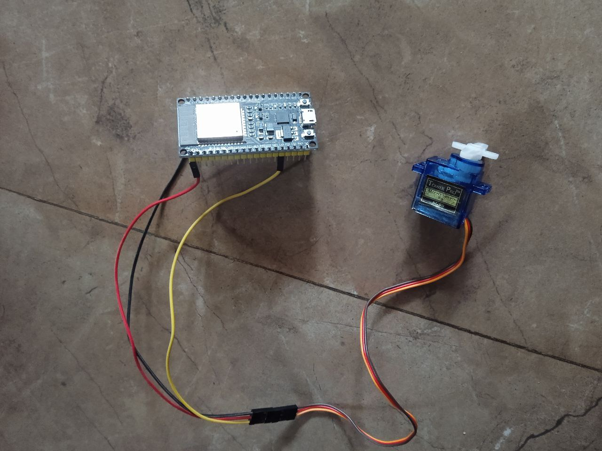

# Normal Switch Automation using servo and Esp32

## Initial Setup

* Connect signal pin of servo to pin D13 of ESP 32.
* Change wifi SSID and Password as per your need in the code.

## Connecting to Esp 32 via wifi 

* Connect your laptop or phone with wifi having SSID as defined in the code. Put password as defined in the code
* open http://192.168.4.1:80
* Now you can control the device by using those on and off buttons

## References

* [Using Servo Motors (SG90) with Platform IO and ESP 32](https://simplyexplained.com/courses/programming-esp32-with-arduino/controlling-servo-motor-sg90/)

* [How to Set an ESP32 Access Point (AP) for Web Server](https://randomnerdtutorials.com/esp32-access-point-ap-web-server)

* [Getting Started with VS Code and PlatformIO IDE for ESP32 and ESP8266 (Windows, Mac OS X, Linux Ubuntu)](https://randomnerdtutorials.com/vs-code-platformio-ide-esp32-esp8266-arduino/)

